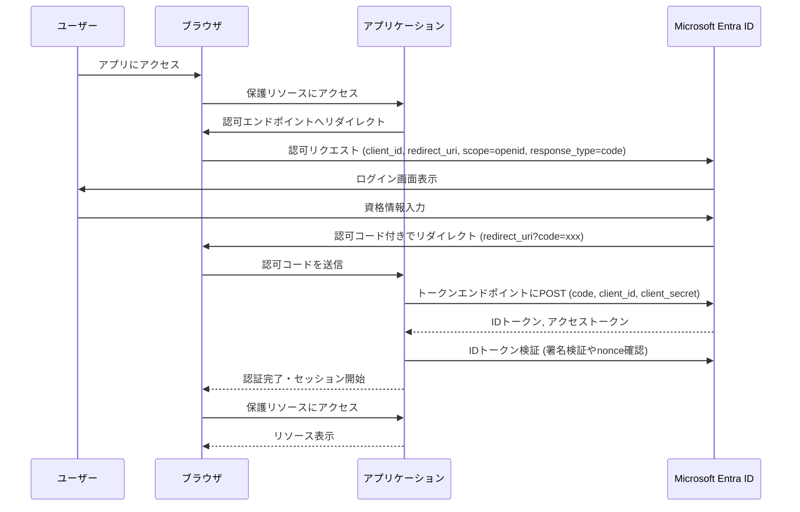

```mermaid
sequenceDiagram
    participant ユーザー
    participant ブラウザ
    participant アプリケーション
    participant EntraID as Microsoft Entra ID

    ユーザー->>ブラウザ: アプリにアクセス
    ブラウザ->>アプリケーション: 保護リソースにアクセス
    アプリケーション->>ブラウザ: 認可エンドポイントへリダイレクト
    ブラウザ->>EntraID: 認可リクエスト (client_id, redirect_uri, scope=openid, response_type=code)
    EntraID->>ユーザー: ログイン画面表示
    ユーザー->>EntraID: 資格情報入力
    EntraID->>ブラウザ: 認可コード付きでリダイレクト (redirect_uri?code=xxx)
    ブラウザ->>アプリケーション: 認可コードを送信
    アプリケーション->>EntraID: トークンエンドポイントにPOST (code, client_id, client_secret)
    EntraID-->>アプリケーション: IDトークン, アクセストークン
    アプリケーション->>EntraID: IDトークン検証 (署名検証やnonce確認)
    アプリケーション-->>ブラウザ: 認証完了・セッション開始
    ブラウザ->>アプリケーション: 保護リソースにアクセス
    アプリケーション-->>ブラウザ: リソース表示

```