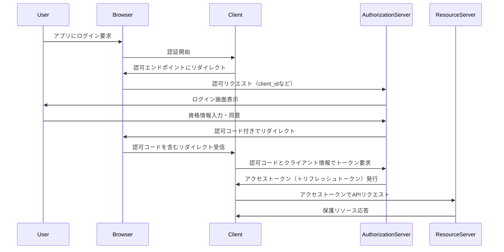

```mermaid
sequenceDiagram
    participant User
    participant Browser
    participant Client
    participant AuthorizationServer
    participant ResourceServer

    User->>Browser: アプリにログイン要求
    Browser->>Client: 認証開始
    Client->>Browser: 認可エンドポイントにリダイレクト
    Browser->>AuthorizationServer: 認可リクエスト（client_idなど）
    AuthorizationServer->>User: ログイン画面表示
    User->>AuthorizationServer: 資格情報入力・同意
    AuthorizationServer->>Browser: 認可コード付きでリダイレクト
    Browser->>Client: 認可コードを含むリダイレクト受信
    Client->>AuthorizationServer: 認可コードとクライアント情報でトークン要求
    AuthorizationServer->>Client: アクセストークン（＋リフレッシュトークン）発行
    Client->>ResourceServer: アクセストークンでAPIリクエスト
    ResourceServer->>Client: 保護リソース応答
```