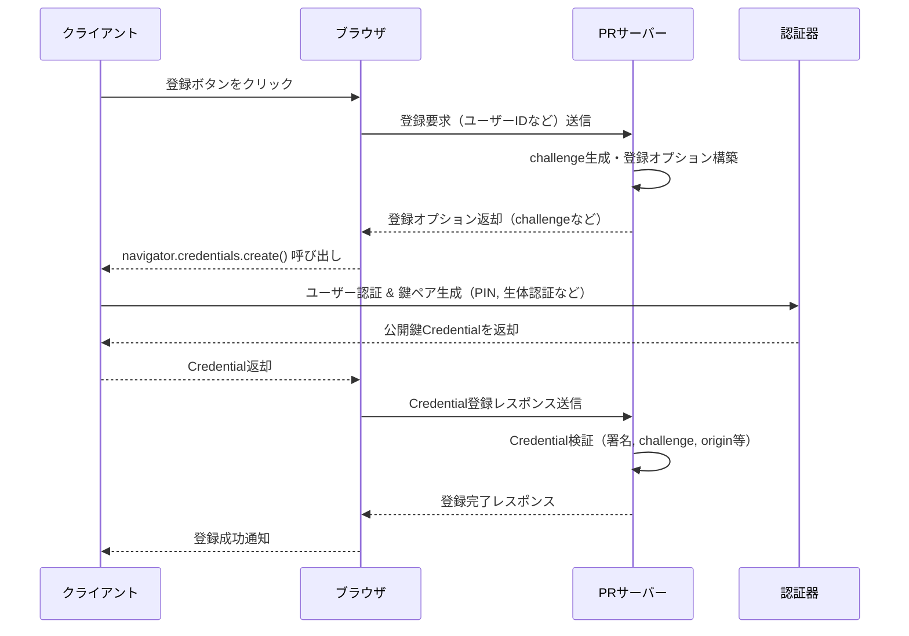

```mermaid
sequenceDiagram
    participant クライアント
    participant ブラウザ
    participant PRサーバー
    participant 認証器

    クライアント->>ブラウザ: 登録ボタンをクリック
    ブラウザ->>PRサーバー: 登録要求（ユーザーIDなど）送信
    PRサーバー->>PRサーバー: challenge生成・登録オプション構築
    PRサーバー-->>ブラウザ: 登録オプション返却（challengeなど）
    ブラウザ-->>クライアント: navigator.credentials.create() 呼び出し
    クライアント->>認証器: ユーザー認証 & 鍵ペア生成（PIN, 生体認証など）
    認証器-->>クライアント: 公開鍵Credentialを返却
    クライアント-->>ブラウザ: Credential返却
    ブラウザ->>PRサーバー: Credential登録レスポンス送信
    PRサーバー->>PRサーバー: Credential検証（署名, challenge, origin等）
    PRサーバー-->>ブラウザ: 登録完了レスポンス
    ブラウザ-->>クライアント: 登録成功通知
```