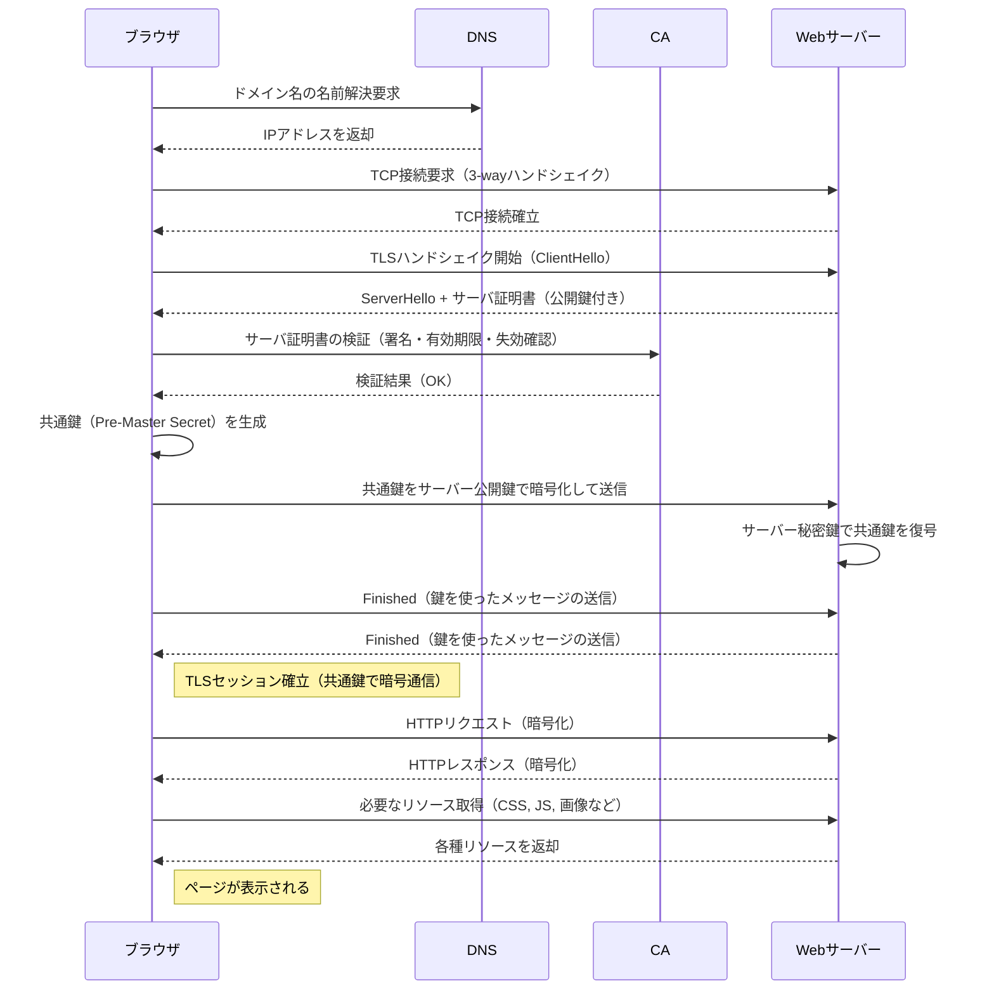

```mermaid
sequenceDiagram
    participant ブラウザ
    participant DNS
    participant CA
    participant Webサーバー

    ブラウザ->>DNS: ドメイン名の名前解決要求
    DNS-->>ブラウザ: IPアドレスを返却

    ブラウザ->>Webサーバー: TCP接続要求（3-wayハンドシェイク）
    Webサーバー-->>ブラウザ: TCP接続確立

    ブラウザ->>Webサーバー: TLSハンドシェイク開始（ClientHello）
    Webサーバー-->>ブラウザ: ServerHello + サーバ証明書（公開鍵付き）

    ブラウザ->>CA: サーバ証明書の検証（署名・有効期限・失効確認）
    CA-->>ブラウザ: 検証結果（OK）

    ブラウザ->>ブラウザ: 共通鍵（Pre-Master Secret）を生成
    ブラウザ->>Webサーバー: 共通鍵をサーバー公開鍵で暗号化して送信
    Webサーバー->>Webサーバー: サーバー秘密鍵で共通鍵を復号

    ブラウザ->>Webサーバー: Finished（鍵を使ったメッセージの送信）
    Webサーバー-->>ブラウザ: Finished（鍵を使ったメッセージの送信）

    Note right of ブラウザ: TLSセッション確立（共通鍵で暗号通信）

    ブラウザ->>Webサーバー: HTTPリクエスト（暗号化）
    Webサーバー-->>ブラウザ: HTTPレスポンス（暗号化）

    ブラウザ->>Webサーバー: 必要なリソース取得（CSS, JS, 画像など）
    Webサーバー-->>ブラウザ: 各種リソースを返却

    Note right of ブラウザ: ページが表示される

```