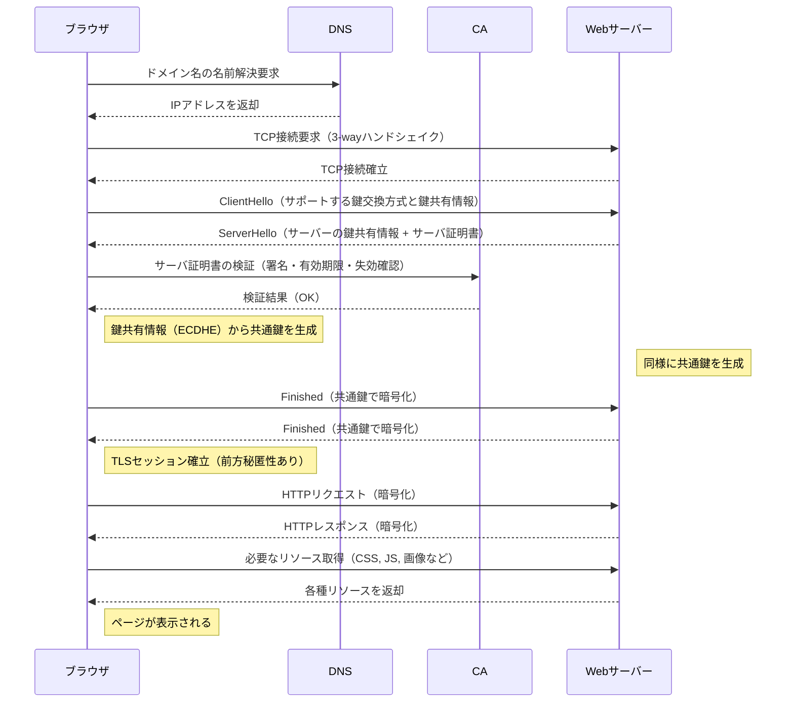

```mermaid
sequenceDiagram
    participant ブラウザ
    participant DNS
    participant CA
    participant Webサーバー

    ブラウザ->>DNS: ドメイン名の名前解決要求
    DNS-->>ブラウザ: IPアドレスを返却

    ブラウザ->>Webサーバー: TCP接続要求（3-wayハンドシェイク）
    Webサーバー-->>ブラウザ: TCP接続確立

    ブラウザ->>Webサーバー: ClientHello（サポートする鍵交換方式と鍵共有情報）
    Webサーバー-->>ブラウザ: ServerHello（サーバーの鍵共有情報 + サーバ証明書）

    ブラウザ->>CA: サーバ証明書の検証（署名・有効期限・失効確認）
    CA-->>ブラウザ: 検証結果（OK）

    Note right of ブラウザ: 鍵共有情報（ECDHE）から共通鍵を生成
    Note right of Webサーバー: 同様に共通鍵を生成

    ブラウザ->>Webサーバー: Finished（共通鍵で暗号化）
    Webサーバー-->>ブラウザ: Finished（共通鍵で暗号化）

    Note right of ブラウザ: TLSセッション確立（前方秘匿性あり）

    ブラウザ->>Webサーバー: HTTPリクエスト（暗号化）
    Webサーバー-->>ブラウザ: HTTPレスポンス（暗号化）

    ブラウザ->>Webサーバー: 必要なリソース取得（CSS, JS, 画像など）
    Webサーバー-->>ブラウザ: 各種リソースを返却

    Note right of ブラウザ: ページが表示される
```