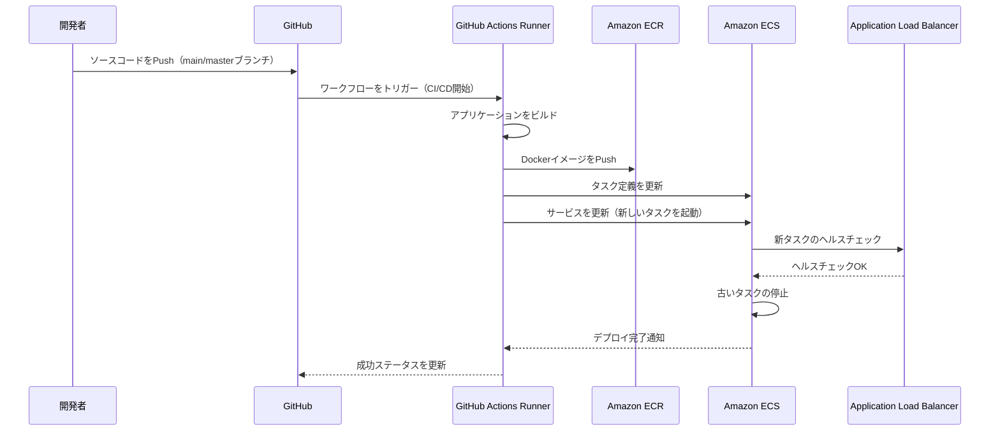

```mermaid
sequenceDiagram
    participant Dev as 開発者
    participant GitHub as GitHub
    participant Actions as GitHub Actions Runner
    participant ECR as Amazon ECR
    participant ECS as Amazon ECS
    participant ALB as Application Load Balancer

    Dev->>GitHub: ソースコードをPush（main/masterブランチ）
    GitHub->>Actions: ワークフローをトリガー（CI/CD開始）

    Actions->>Actions: アプリケーションをビルド
    Actions->>ECR: DockerイメージをPush
    Actions->>ECS: タスク定義を更新
    Actions->>ECS: サービスを更新（新しいタスクを起動）

    ECS->>ALB: 新タスクのヘルスチェック
    ALB-->>ECS: ヘルスチェックOK
    ECS->>ECS: 古いタスクの停止

    ECS-->>Actions: デプロイ完了通知
    Actions-->>GitHub: 成功ステータスを更新
```